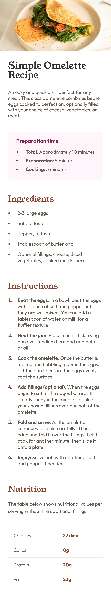

# 🍳 Simple Omelette Recipe Page

> A beautifully crafted recipe page showcasing modern CSS techniques and responsive design principles. This Frontend Mentor challenge demonstrates clean typography, elegant spacing, and mobile-first development.

## 🌟 Overview

This project presents a stunning recipe page for a classic omelette dish, featuring:

- **Elegant Typography**: Custom font combinations using Young Serif and Outfit
- **Responsive Design**: Seamless experience from mobile to desktop
- **Modern CSS**: Clean styling with custom properties and semantic HTML
- **Accessibility**: Proper structure and readable content hierarchy

## 📸 Screenshots

### Desktop View


### Mobile View


## 🛠️ Built With

- **HTML5** - Semantic markup for better accessibility
- **CSS3** - Modern styling with custom properties
- **Google Fonts** - Young Serif & Outfit font families
- **Flexbox** - Layout and alignment
- **CSS Grid** - Table structure for nutrition information
- **Media Queries** - Responsive breakpoints

## 🎨 Key Features

### 🎯 Design Highlights
- **Custom Color Palette**: Warm stone and rose tones for cozy feeling
- **Typography Scale**: Harmonious font sizes using rem units
- **Visual Hierarchy**: Clear content sections with proper spacing
- **Interactive Elements**: Styled lists with custom markers

### 📱 Responsive Behavior
- **Mobile-First**: Optimized for small screens
- **Desktop Enhancement**: Card-based layout with shadows
- **Fluid Typography**: Scalable text across devices
- **Flexible Images**: Properly sized banner image

## 🏗️ Project Structure

```
challenge-one-recipe-page/
├── 📄 index.html          # Main HTML structure
├── 🎨 style.css           # Complete stylesheet
├── 📁 assets/             # Images and icons
│   ├── favicon.png
│   └── image-omelette.jpeg
├── 📁 screenshots/        # Project previews
│   ├── desktop-screenshot.png
│   └── mobile-screenshot.png
└── 📖 README.md          # Project documentation
```

## 🚀 Getting Started

### Quick Start
1. Clone or download this repository
2. Open `index.html` in your browser
3. Enjoy the beautiful recipe page!

## 💡 CSS Techniques Demonstrated

### Custom Properties (CSS Variables)
```css
:root {
  --stone-100: #f3e6d8;
  --brown-800: #854632;
  --rose-800: #7b284f;
  --default-text-size: 1.8rem;
}
```

### Responsive Typography
```css
html {
  font-size: 62.5%; /* 1rem = 10px */
}

@media (min-width: 1024px) {
  :root {
    --default-text-size: 1.6rem;
  }
}
```

### Modern List Styling
```css
.ingredients-section > ul > li::marker {
  color: var(--brown-800);
  font-weight: bold;
}
```

## 🎯 Learning Outcomes

- ✅ **Semantic HTML**: Proper document structure
- ✅ **CSS Custom Properties**: Maintainable color system
- ✅ **Responsive Design**: Mobile-first approach
- ✅ **Typography**: Font pairing and hierarchy
- ✅ **Layout Techniques**: Flexbox and positioning
- ✅ **Modern CSS**: Box-sizing and object-fit

## 🌍 Browser Compatibility

- ✅ Chrome 90+
- ✅ Firefox 88+
- ✅ Safari 14+
- ✅ Edge 90+

## 🤝 Contributing

This is a Frontend Mentor challenge solution. Feel free to:
- ⭐ Star this repository if you found it helpful
- 🍴 Fork it to try your own version
- 💡 Suggest improvements via issues
- 📝 Share feedback on the implementation

## 📜 License

This project is open source and available under the [MIT License](LICENSE).

## 👨‍💻 Author

**Muhaideen Nausar**
- GitHub: [@muhaideennausar](https://github.com/muhaideennausar)
- Frontend Mentor: [@muhaideennausar](https://www.frontendmentor.io/profile/muhaideennausar)

---

### 🙏 Acknowledgments

- [Frontend Mentor](https://www.frontendmentor.io) for the amazing challenge
- [Google Fonts](https://fonts.google.com) for the beautiful typography
- The web development community for inspiration and best practices

---

<div align="center">
  <p><strong>⚡ Built with passion for clean, accessible web design ⚡</strong></p>
  <p><em>Part of my Frontend Mentor challenge solutions collection</em></p>
</div>