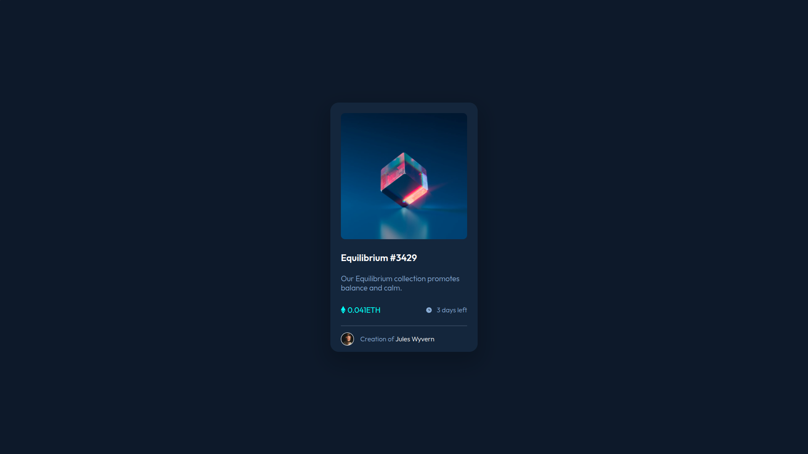
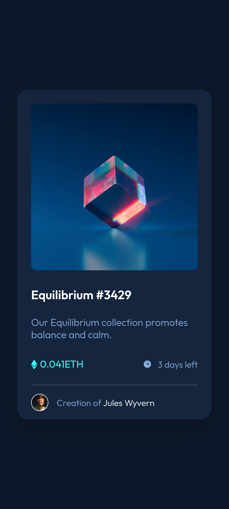

# NFT Preview Card

A clean and responsive solution to the [Frontend Mentor NFT Preview Card challenge](https://www.frontendmentor.io/challenges/nft-preview-card-component-SbdUL_w0U).

This project was built with semantic HTML and CSS, with a simple layout, hover interactions, and a mobile-friendly design.

## Live Demo

- **GitHub Repository:** [frontend-mentor-solutions/nft-preview-card](https://github.com/muhaideennausar/frontend-mentor-solutions/tree/main/nft-preview-card)
- **Live Site:** [NFT Preview Card](https://muhaideennausar.github.io/frontend-mentor-solutions/nft-preview-card/)

## Preview

### Desktop

### Mobile

## Built With

- HTML5
- CSS3
- Flexbox
- Responsive design
- Google Fonts: Outfit

## Features

- Responsive card layout
- Hover effect on the NFT image overlay
- Hover states for the title and author name
- Clean and minimal design
- Organized folder structure for easy GitHub Pages deployment

## Folder Structure

    nft-preview-card/
    ├── assets/
    │   ├── icon-clock.svg
    │   ├── icon-ethereum.svg
    │   ├── icon-view.svg
    │   ├── image-avatar.png
    │   └── image-equilibrium.jpg
    ├── screenshots/
    │   ├── desktop-screenshot.png
    │   └── mobile-screenshot.png
    ├── index.html
    ├── style.css
    └── README.md

## How It Works

The card is centered on the page and uses a dark theme background with a highlighted NFT preview image. Hovering over the image reveals a view icon overlay, and the title and author name also respond to hover interactions.

## What I Learned

- Structuring a simple responsive component with HTML and CSS
- Using flexbox for alignment and spacing
- Creating hover effects with overlays
- Organizing a Frontend Mentor challenge inside a GitHub mono repo

## Challenge Source

- [Frontend Mentor](https://www.frontendmentor.io)

## Author

- **Muhaideen Nausar**
