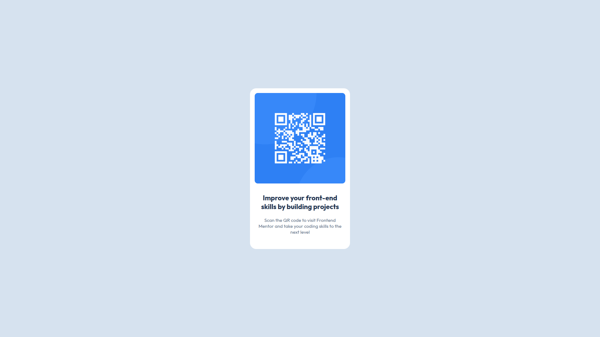
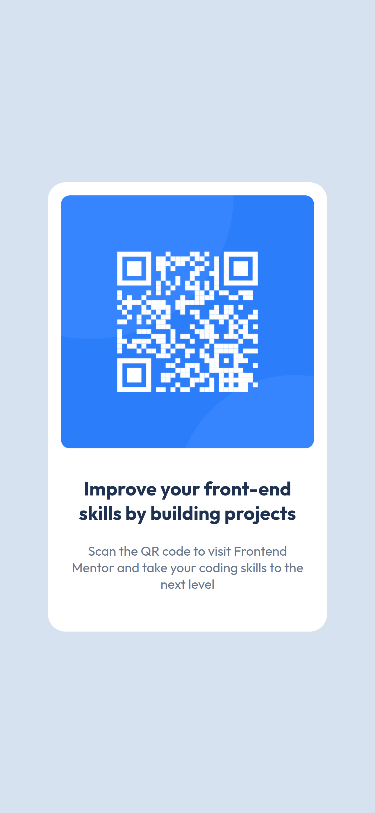

# 📦 QR Code Component

A clean and responsive **QR Code Component** built as part of a Frontend Mentor challenge. This project focuses on mastering layout fundamentals, typography, and pixel-perfect UI implementation using pure HTML and CSS.

---

## 🚀 Overview

This is a beginner-friendly project designed to strengthen core front-end skills. The goal was to recreate a simple yet polished UI component while maintaining visual accuracy and responsiveness.

---

## 🧠 What I Practiced

- Semantic HTML structure
- CSS layout techniques (Flexbox)
- Responsive design principles
- Typography and spacing consistency
- Clean and scalable CSS architecture

---

## 🗂️ Project Structure

Since this is part of a **monorepo**, this challenge exists as a subfolder:

```text
qr-code-component/
├── assets/
│   └── image-qr-code.png
├── screenshots/
│   ├── desktop-screenshot.png
│   └── mobile-screenshot.png
├── index.html
├── style.css
└── qr-code-component.fig
```

---

## 🖼️ Preview

### 💻 Desktop



### 📱 Mobile



---

## 🔗 Live Demo

> https://muhaideennausar.github.io/frontend-mentor-solutions/qr-code-component/

---

## ⚙️ Built With

- HTML5
- CSS3
- Flexbox
- Google Fonts (Outfit)

---

## 📄 Key Implementation Details

### 📌 HTML Structure

- Semantic layout with a clear container:
  - `.component-container` wraps the entire card
  - Image and text are separated for clarity
- Responsive meta tags included for proper scaling
- SEO-friendly meta description and keywords

---

### 🎨 CSS Styling

- CSS variables used for consistent color theming
- Flexbox used for centering and layout control
- Scalable typography using `em` units
- Clean spacing system using padding and gap
- Mobile-first approach with fluid sizing

---

## 💡 Design Decisions

- **Centered Layout:** Used Flexbox on `body` to vertically and horizontally center the component
- **Typography Scaling:** Set `font-size: 62.5%` to simplify `rem/em` calculations
- **Reusable Classes:** Created utility-like classes for font weights and sizes
- **Rounded UI:** Soft border radius for a modern card look

---

## 📈 Improvements (Future Ideas)

- Add hover or subtle animation effects
- Convert to a reusable component (React/Vue)
- Improve accessibility (ARIA roles, better alt text context)
- Add dark mode support

---

## 🙌 Acknowledgements

- Challenge by **Frontend Mentor**
- Design inspiration and guidelines provided by the platform

---

## 👤 Author

**Muhaideen Nausar**

- Frontend enthusiast focused on building clean and scalable UI
- Working through Frontend Mentor challenges to level up skills

---

## 📌 Notes

This project is part of a larger **monorepo of frontend challenges**, where each folder represents a standalone implementation.

---

⭐ If you found this helpful or inspiring, consider giving the repo a star!
